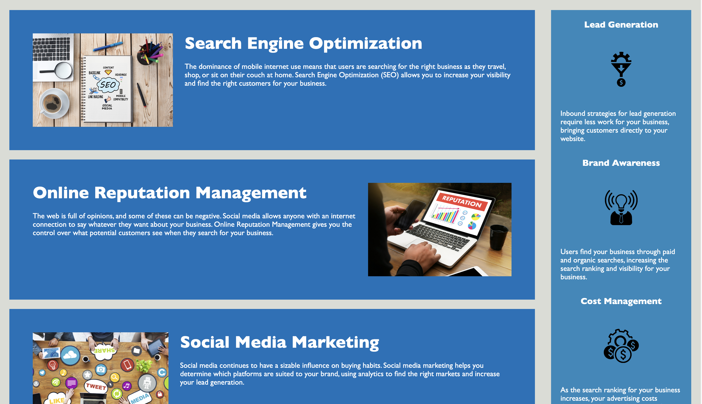

# Horiseon

## Description

I needed to clone the repository and refactor the code to meet Acceptance Criteria (find semantics in HTML code, add accessible alt attritubutes...)

## Work Completed

* Restructured CSS to remove any unnecessary code
* Added alt attributes to images
* Changed website title
* Added a Readme
* Deployed live url

## Website

https://cj-saurus.github.io/Horiseon/

## Screenshots

